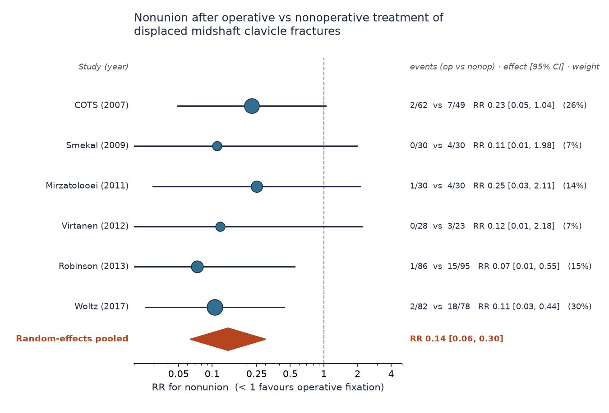
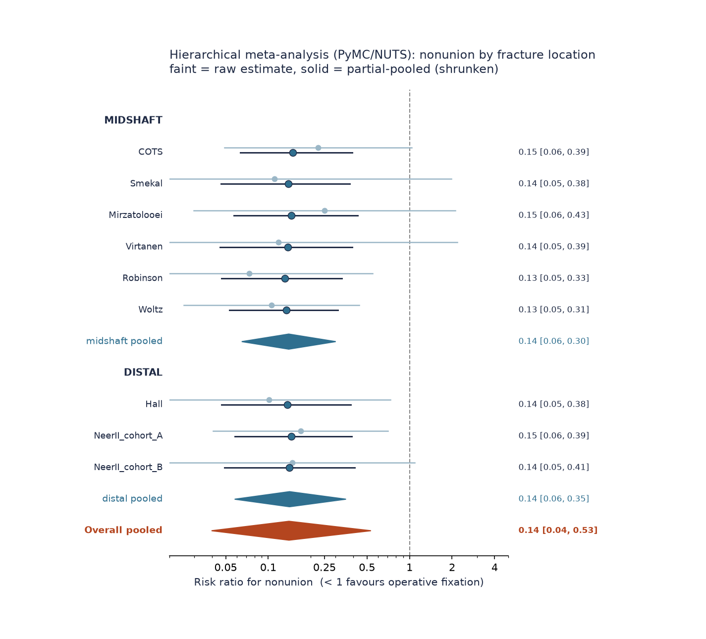
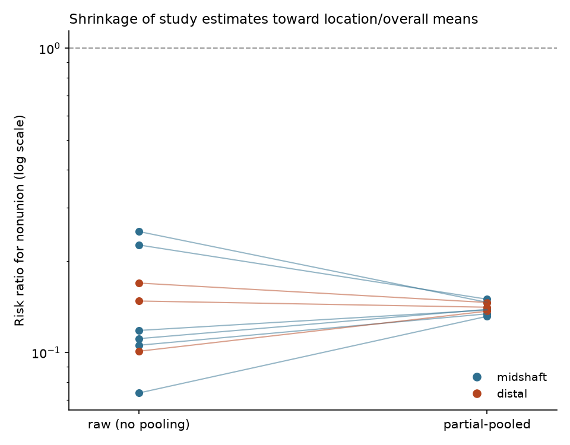
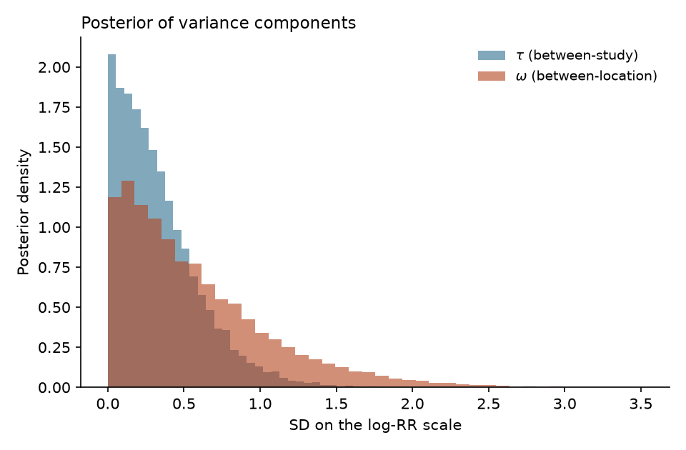
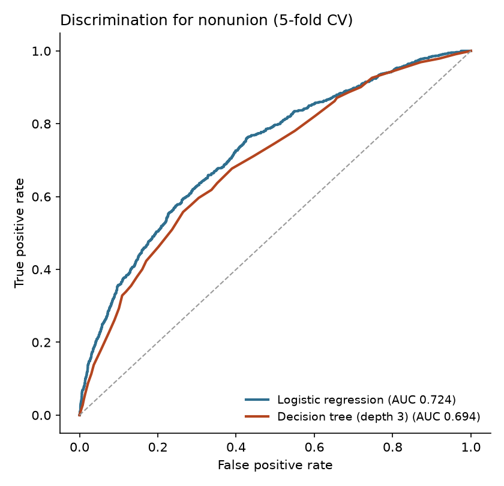
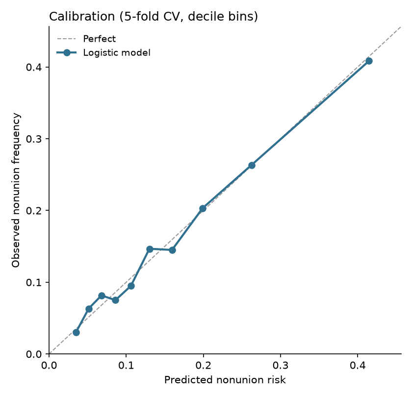
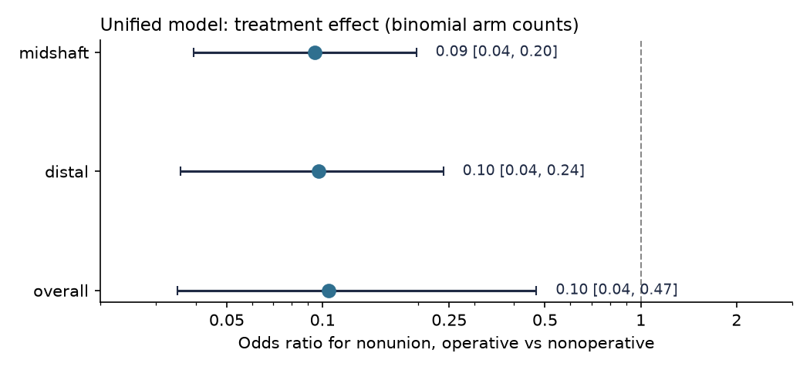
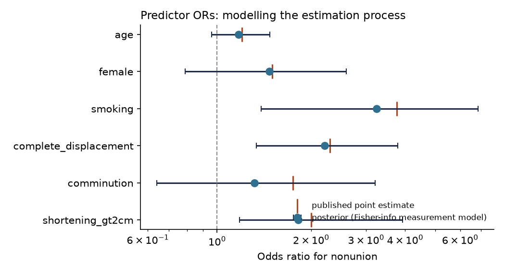

# Clavicle fracture outcomes: meta-analysis and interpretable risk model

*Auto-generated by `run_all.py`. Figures are in `../outputs/`.*

This project answers three linked questions about **clavicle fractures**:

1. **Intervention effect (midshaft)** — does operative fixation reduce nonunion
   versus nonoperative care, and by how much? (random-effects meta-analysis)
2. **Does that hold for distal fractures too?** — a hierarchical Bayesian
   meta-analysis pooling across fracture location (midshaft + distal).
3. **Individual risk** — for a patient treated nonoperatively, what is their
   probability of nonunion given patient and fracture factors? (an interpretable
   predictive model)

Data provenance, references and an honesty note on the modelling are in
[`../data/REFERENCES.md`](../data/REFERENCES.md).

---

## Part 1 — Meta-analysis: operative vs nonoperative

Six randomized controlled trials (623
patients) compared plate/intramedullary fixation with sling immobilisation for
displaced midshaft clavicle fractures, reporting nonunion.



**Headline result**

| Metric | Value |
|---|---|
| Crude nonunion, operative | 1.9% |
| Crude nonunion, nonoperative | 16.7% |
| Absolute risk reduction | 14.8 percentage points |
| Number needed to treat (surgery to prevent 1 nonunion) | 7 |
| Pooled risk ratio (random effects) | **0.14** (95% CI 0.06–0.30) |
| Pooled odds ratio (random effects) | 0.12 (95% CI 0.05–0.27) |
| Heterogeneity | I² = 0%, τ² = 0.000, Cochran Q p = 0.94 |

Operative fixation reduces the relative risk of nonunion by roughly
**86%**. Heterogeneity is negligible (I² = 0%),
so the trials tell a consistent story, and the pooled estimate matches the
published literature (RR ≈ 0.14). **But** the NNT of ~7 means most
patients treated nonoperatively still unite; surgery carries its own harms
(hardware, infection, ~17% elective plate removal in Woltz). This is exactly
why an *individual* risk model is useful — to target surgery at the patients
most likely to fail nonoperative care.

The method is DerSimonian–Laird random effects on the log risk ratio with a 0.5
continuity correction for zero-event arms, implemented transparently in
[`src/meta_analysis.py`](../src/meta_analysis.py).

---

## Part 2 — Hierarchical meta-analysis: does it hold for distal fractures?

Distal (lateral-third / Neer type II) clavicle fractures behave differently
biomechanically and have a **much sparser evidence base** — essentially one RCT
(Hall 2021) plus observational comparative cohorts. Analysing them alone gives
wide, unstable estimates; ignoring location and lumping everything together
hides real differences. A **hierarchical (multilevel) model** is the right tool:
studies are nested within fracture location, and both levels have their own
variance, so the distal subgroup **borrows strength** from the overall effect
while still getting its own estimate.

**Model** (3-level, on the log risk ratio; fitted with PyMC / NUTS):

```
y_i      ~ Normal(theta_i, s_i^2)        # observed log-RR | study effect
theta_i  ~ Normal(mu_location, tau^2)     # study | fracture-location mean
mu_g     ~ Normal(M, omega^2)             # location mean | overall mean
M ~ Normal(0, 10);  tau, omega ~ HalfNormal(1)
```

Non-centred parameterisation, 4 chains. Convergence was clean
(**0 divergences, max R-hat = 1.000**, ESS in
the thousands — see [`outputs/hier_diagnostics.csv`](../outputs/hier_diagnostics.csv)).



| Estimate | Pooled RR for nonunion (95% credible interval) |
|---|---|
| **Overall (both locations)** | **0.14** (0.04–0.53) |
| Midshaft | 0.14 (0.06–0.30) |
| Distal (lateral-third) | 0.14 (0.06–0.35) |
| Between-study SD, τ | 0.27 (0.01–1.01) |
| Between-location SD, ω | 0.45 (0.02–1.84) — weakly identified (2 groups) |

**Findings**

- Operative fixation reduces nonunion in **both** locations; the location means
  are almost identical (posterior probability that midshaft RR < distal RR ≈
  0.51 — i.e. no evidence of a location difference in the
  *relative* effect).
- **Partial pooling tightens the sparse distal estimate.** Fitting distal
  studies on their own (no cross-location pooling) gives RR
  0.14 (0.05–0.39);
  the hierarchical model sharpens this to
  0.14 (0.06–0.35) by
  borrowing strength from the overall effect. The shrinkage of every study toward
  its group/overall mean is shown below.
- The **overall** credible interval (0.04–0.53)
  is *wider* than either subgroup — correctly, because it propagates the
  between-location uncertainty (ω) rather than pretending the two locations are
  the same study population.




**Clinical caveat that the relative effect hides:** distal fractures have a far
higher *baseline* nonoperative nonunion risk (≈ 30–40% vs ≈ 15% midshaft), so
the same relative risk ratio implies a **larger absolute benefit** from surgery
in distal fractures. The relative effect is portable across location; the
absolute stakes are not. Implemented in
[`src/hierarchical_meta.py`](../src/hierarchical_meta.py).

---

## Part 3 — Interpretable predictive model for nonunion

Target: probability of nonunion after **nonoperative** treatment. Predictors are
the factors with the strongest and most reproducible evidence
(see `REFERENCES.md`): **smoking, complete displacement, fracture shortening
> 2 cm, comminution, female sex, and age**.

The brief asked for models that are *interpretable but have high predictive
power*. We built three and compared them under 5-fold cross-validation:

| model                          |   AUC_cv |   Brier_cv |
|:-------------------------------|---------:|-----------:|
| Logistic regression            |    0.724 |      0.116 |
| Decision tree (depth 3)        |    0.694 |      0.12  |
| Points score (a priori, unfit) |    0.722 |    nan     |

The two interpretable options — full logistic regression and the paper-and-pencil
**points score** — have essentially identical discrimination, and both beat the
decision tree. **Interpretability costs almost nothing here**, so the
recommended deployable model is the logistic regression (for a precise number)
or its distilled points score (for bedside use). An AUC around 0.72 is in line
with published clavicle nonunion models.

### 2a. Logistic regression (fitted OR vs published OR)

| term                  |   OR_fitted |   OR_ci_low |   OR_ci_high |   p_value |   OR_published |
|:----------------------|------------:|------------:|-------------:|----------:|---------------:|
| const                 |       0.042 |       0.036 |        0.051 |         0 |         nan    |
| age_decades_c         |       1.217 |       1.155 |        1.281 |         0 |           1.2  |
| female                |       1.475 |       1.262 |        1.724 |         0 |           1.5  |
| smoking               |       3.415 |       2.929 |        3.982 |         0 |           3.76 |
| complete_displacement |       2.1   |       1.779 |        2.479 |         0 |           2.3  |
| comminution           |       1.526 |       1.309 |        1.779 |         0 |           1.75 |
| shortening_gt2cm      |       1.974 |       1.691 |        2.304 |         0 |           2    |

The fitted odds ratios recover the published effect sizes, which validates the
pipeline (see the honesty note in `REFERENCES.md` — the cohort is synthesised
from these published ORs because patient-level data is not public).

### 2b. Points score (bedside calculator)

One point equals one decade of age; every other factor is scaled to that unit.
Add the points, then read risk off the lookup curve
([`outputs/score_risk_lookup.csv`](../outputs/score_risk_lookup.csv)).

| factor                | condition                          |   points |
|:----------------------|:-----------------------------------|---------:|
| age                   | per decade over 40                 |        1 |
| female                | present (ref: male)                |        2 |
| smoking               | present (ref: nonsmoker)           |        7 |
| complete_displacement | present (ref: partial/undisplaced) |        5 |
| comminution           | present (ref: simple)              |        3 |
| shortening_gt2cm      | present (ref: <2cm)                |        4 |

### 2c. Discrimination and calibration




The logistic model is well calibrated across the full risk range.

### 2d. Worked examples

| patient                                               |   predicted_risk_pct |   points |
|:------------------------------------------------------|---------------------:|---------:|
| Low risk (young male, minimally displaced)            |                  3.1 |        0 |
| Typical displaced fracture                            |                  8.2 |        5 |
| High risk (older female smoker, comminuted+shortened) |                 66.7 |       23 |

A young, minimally displaced fracture has a single-digit nonunion risk (surgery
rarely justified), whereas an older female smoker with a comminuted, shortened,
completely displaced fracture is a coin-flip — the group in whom the meta-analytic
benefit of surgery is concentrated.

---

## Part 3b — A single model fit to all the published counts

Parts 1–3 use the data in two stages: a meta-analysis for the *effect* and a
separate model for *baseline risk*. This part does it in **one Bayesian fit**.
Each trial arm's nonunion count is modelled directly as **binomial**, so there
is no log-RR normal approximation and no continuity correction for the zero-event
arms; the published multivariable odds ratios enter the same model as an
evidence block. Baseline risk (by location), the treatment effect, and the
patient-factor slopes therefore all come out of **one joint posterior** with
coherent uncertainty. Fitted with PyMC/NUTS
(**0 divergences, max R-hat = 1.000**).



| Quantity | Estimate |
|---|---|
| Treatment effect, overall (OR) | **0.10** (0.04–0.47) |
| Treatment effect, midshaft (OR) | 0.09 (0.04–0.20) |
| Treatment effect, distal (OR) | 0.10 (0.04–0.24) |
| Reference-patient baseline nonunion, midshaft | 5.6% (3.4–9.4%) |
| Reference-patient baseline nonunion, distal | 10.5% (5.8–18.1%) |

The binomial treatment OR (0.10) agrees with the earlier
normal-approximation meta-analysis (OR ≈ 0.12) but is slightly stronger, because
the exact binomial likelihood does not need to pull the zero-event arms toward
the null with a continuity correction. The predictor slopes are recovered from
the evidence block (posterior vs published OR):

| predictor             |   OR_posterior |   OR_lo |   OR_hi |   OR_published |
|:----------------------|---------------:|--------:|--------:|---------------:|
| age                   |           1.2  |    1.04 |    1.39 |           1.2  |
| female                |           1.52 |    0.97 |    2.25 |           1.5  |
| smoking               |           3.79 |    1.73 |    7.24 |           3.76 |
| complete_displacement |           2.31 |    1.36 |    3.73 |           2.3  |
| comminution           |           1.77 |    1.04 |    2.83 |           1.75 |
| shortening_gt2cm      |           2.03 |    1.18 |    3.29 |           2    |

**Why a single fit helps:** the individualised calculator (Part 4) reads
baseline, effect and predictor slopes off *one* posterior, so uncertainty is
propagated consistently rather than by combining independent fits. Part 3c
refines this fit further. Implemented in
[`src/unified_model.py`](../src/unified_model.py).

*(Note: aggregate arm counts cannot by themselves identify the patient-factor
slopes — those are pinned by the published-OR evidence block. The gain is a
single coherent fit that uses the counts as counts, not a normal approximation.)*

---

## Part 3c — Integrating the risk factors out as latent variables

The unified model maps the reference-patient baseline to the trial population
rate with a **linear** offset. That is only a first-order approximation: because
risk is a *nonlinear* (sigmoid) function of the covariates, the average of
`sigmoid(risk)` over a heterogeneous population is **not** `sigmoid(average
risk)` (Jensen's inequality). This model fixes that by treating each patient's
risk factors as **latent** and integrating them out of the aggregate counts
exactly — enumerating all 2⁵ binary risk-factor profiles (weighted by their
prevalences) and Gauss–Hermite quadrature over the age distribution. The
published **prevalences** and **odds ratios** both enter as data blocks:

```
p_arm = E_x[ sigmoid( base_ref[loc] + treat + gamma·x ) ]     # exact expectation
counts      : y_arm ~ Binomial(n_arm, p_arm)
prevalences : published prevalence ~ Binomial(N_eff, prev_k)
odds ratios : published logOR_k    ~ Normal(gamma_k, se_k)
```

Deterministic quadrature is used rather than sampling ages: for a smooth 1-D
integral, ~8 quadrature nodes are exact, whereas Monte-Carlo draws would inject
noise into the log-density and degrade NUTS. Clean sampling
(**0 divergences, max R-hat = 1.000**).

| Quantity | Linear-offset (3b) | **Latent-marginalised (3c)** |
|---|---|---|
| Treatment OR, midshaft | 0.09 | 0.08 (0.03–0.17) |
| Treatment OR, distal | 0.10 | 0.08 (0.03–0.20) |
| Reference-patient baseline, midshaft | 5.6% | **4.5%** (2.4–8.2%) |
| Reference-patient baseline, distal | 10.5% | **9.4%** (4.7–17.3%) |

The exact marginalisation pulls the **reference-patient baseline down** relative
to the linear offset (midshaft 5.6% →
4.5%): high-risk patients contribute
disproportionately to the aggregate nonunion count, so attributing the whole
population rate to an "average" linear shift overstates the low-risk reference
patient's baseline. This is the Jensen correction in action. The latent
prevalences are recovered from the data with proper uncertainty:

| factor                |   prev_posterior |   prev_lo |   prev_hi |   prev_published |
|:----------------------|-----------------:|----------:|----------:|-----------------:|
| female                |             0.3  |      0.23 |      0.38 |             0.3  |
| smoking               |             0.26 |      0.19 |      0.33 |             0.25 |
| complete_displacement |             0.55 |      0.47 |      0.62 |             0.55 |
| comminution           |             0.35 |      0.28 |      0.43 |             0.35 |
| shortening_gt2cm      |             0.3  |      0.23 |      0.38 |             0.3  |

Implemented in
[`src/latent_integration_model.py`](../src/latent_integration_model.py).

---

## Part 3d — Modelling how the published odds ratios were estimated

All the models so far feed each published OR in as `logOR_k ~ Normal(gamma_k,
reported_se_k)`. That (a) trusts the reported standard error, (b) treats the
coefficients as *independent* even though each source study fitted them jointly,
and (c) is a Wald approximation detached from the data that produced it. This
model instead builds a **measurement model of the estimation process**: each
source cohort fitted a logistic regression to its individual patients, so its
reported coefficients are the maximum-likelihood estimate, whose sampling
distribution is

```
gamma_hat_s ~ MvNormal( gamma , V_s ) ,   V_s = [ N_s · E_x( w(x) x xᵀ ) ]⁻¹
```

— the inverse *expected Fisher information*. `V_s` is derived from the study's
**design** (sample size `N_s`, covariate distribution, baseline outcome rate)
and the shared coefficients, not from reported SEs. It automatically supplies the
across-coefficient correlations and scales precision with the information the
study actually had. Each source cohort's overall nonunion count is used as data
too (`y_s ~ Binomial(N_s, marginal rate)`). Source cohorts (Robinson 2004,
N=868; Murray 2013, N=200) are in
[`data/source_studies.csv`](../data/source_studies.csv). Clean sampling
(**0 divergences, max R-hat = 1.000**).

Predictor ORs under the estimation-process model (posterior vs published point
estimate):

| predictor             |   OR_posterior |   OR_lo |   OR_hi |   OR_published |
|:----------------------|---------------:|--------:|--------:|---------------:|
| age                   |           1.2  |    0.97 |    1.48 |           1.2  |
| female                |           1.47 |    0.82 |    2.62 |           1.5  |
| smoking               |           3.53 |    1.58 |    7.87 |           3.76 |
| complete_displacement |           2.21 |    1.19 |    4    |           2.3  |
| comminution           |           1.67 |    0.77 |    3.58 |           1.75 |
| shortening_gt2cm      |           1.95 |    1.11 |    3.45 |           2    |



The covariance `V_s` supplies the *shape* of each cohort's coefficient
uncertainty — its scale set by the cohort's sample size and outcome rate, and its
cross-coefficient correlations by the design (full matrix in
[`outputs/ipd_gamma_correlation.csv`](../outputs/ipd_gamma_correlation.csv)). Here
those correlations turn out small (|corr| ≤ 0.03), which is
the *correct* result: with roughly independent covariates the intercept absorbs
the shared level and the logistic coefficient estimates are nearly uncorrelated.
The value of this model is therefore not correlation but **honest,
design-derived uncertainty** — SEs implied by each cohort's size rather than
taken on faith from a reported CI — plus a correctly specified likelihood.

Two subtleties are worth stating explicitly, because getting them wrong is easy:

- **The covariance is evaluated once, at the published estimate, and held
  constant.** The MLE's *sampling distribution* does depend on the true γ
  (`γ̂ ~ MVN(γ, I(γ)⁻¹)`), but the object the joint model needs is each study's
  *likelihood contribution*, whose quadratic approximation has curvature = the
  observed information at the estimate (for a canonical-link logistic model
  observed = expected information, so this is exact). Letting the sampled γ into
  the covariance instead adds a spurious `½·log|I(γ)|` term and a funnel, which
  produces degenerate coefficient correlations and poor mixing. Genuine
  γ-dependence would require the exact IPD likelihood (reconstructing patient
  records), which the published summaries don't give us.
- The treatment effect and baseline are essentially unchanged (midshaft OR
  0.08, reference baseline
  4.6%) — as they should be, since
  this model only refines *predictor* uncertainty.

It is the **default** used by `predict.py`. Implemented in
[`src/ipd_evidence_model.py`](../src/ipd_evidence_model.py).

*(Residual approximations: asymptotic normality of the MLE — the same assumption
behind any published Wald CI — and using the shared latent prevalences for each
cohort's information, since the cohorts' own covariate tables are not published.)*

---

## Part 4 — Putting it together: individualised benefit of surgery

The quantity a patient actually cares about is their **absolute** risk reduction
and number-needed-to-treat from surgery:

```
logit risk_nonop = base_ref[location] + sum_k gamma_k * x_k
logit risk_op    = logit risk_nonop + treatment_effect[location]
ARR = risk_nonop - risk_op ;   NNT = 1 / ARR
```

By default these are read straight off the **estimation-process joint posterior**
from Part 3d, so baseline, treatment effect and (correlated) predictor slopes are
mutually consistent and all uncertainty is propagated together (every number
carries a 95% credible interval). (`predict.py --model latent | unified |
two-stage` give cross-checks.)

| patient                                       | nonop risk   | op risk   | ARR   | NNT (95% CrI)   | interpretation                    |
|:----------------------------------------------|:-------------|:----------|:------|:----------------|:----------------------------------|
| Young, minimally displaced (midshaft)         | 3%           | 0%        | 3%    | 31 (15-72)      | small absolute benefit (high NNT) |
| Typical displaced midshaft                    | 10%          | 1%        | 9%    | 12 (6-24)       | moderate absolute benefit         |
| Older smoker, comminuted+shortened (midshaft) | 73%          | 17%       | 53%   | 2 (1-3)         | large absolute benefit (low NNT)  |
| Displaced distal (Neer II)                    | 23%          | 2%        | 21%   | 5 (3-10)        | large absolute benefit (low NNT)  |

The relative effect of surgery is nearly constant, but the **absolute** benefit
ranges from trivial (high NNT for a young minimally displaced fracture — surgery
hard to justify) to decisive (NNT ≈ 2 for a high-risk midshaft, low single
digits for a displaced distal fracture). This is the clinical payoff of the whole
analysis, and it is exactly what the command-line tool exposes:

```bash
python predict.py --age 62 --female --smoking --displacement --comminution --shortening
python predict.py --age 55 --displacement --location distal
python predict.py --age 40 --smoking --displacement --json   # machine-readable
```

Implemented in [`src/treatment_benefit.py`](../src/treatment_benefit.py) (both
the unified and two-stage paths) and [`predict.py`](../predict.py).

---

## How to reproduce

```bash
pip install -r requirements.txt
python run_all.py
```

All figures and tables are regenerated into `outputs/`, and this report is
rewritten from the results. To run the predictive pipeline on **real** data,
replace `build_cohort()` in `src/risk_model.py` with a loader for a CSV that has
columns: age, female, smoking, complete_displacement, comminution,
shortening_gt2cm, nonunion.

### Decision-tree rules (for reference)

```
|--- smoking <= 0.50
|   |--- complete_displacement <= 0.50
|   |   |--- age_decades_c <= 0.40
|   |   |   |--- class: 0
|   |   |--- age_decades_c >  0.40
|   |   |   |--- class: 0
|   |--- complete_displacement >  0.50
|   |   |--- shortening_gt2cm <= 0.50
|   |   |   |--- class: 0
|   |   |--- shortening_gt2cm >  0.50
|   |   |   |--- class: 0
|--- smoking >  0.50
|   |--- complete_displacement <= 0.50
|   |   |--- shortening_gt2cm <= 0.50
|   |   |   |--- class: 0
|   |   |--- shortening_gt2cm >  0.50
|   |   |   |--- class: 0
|   |--- complete_displacement >  0.50
|   |   |--- age_decades_c <= 1.32
|   |   |   |--- class: 0
|   |   |--- age_decades_c >  1.32
|   |   |   |--- class: 1
```
